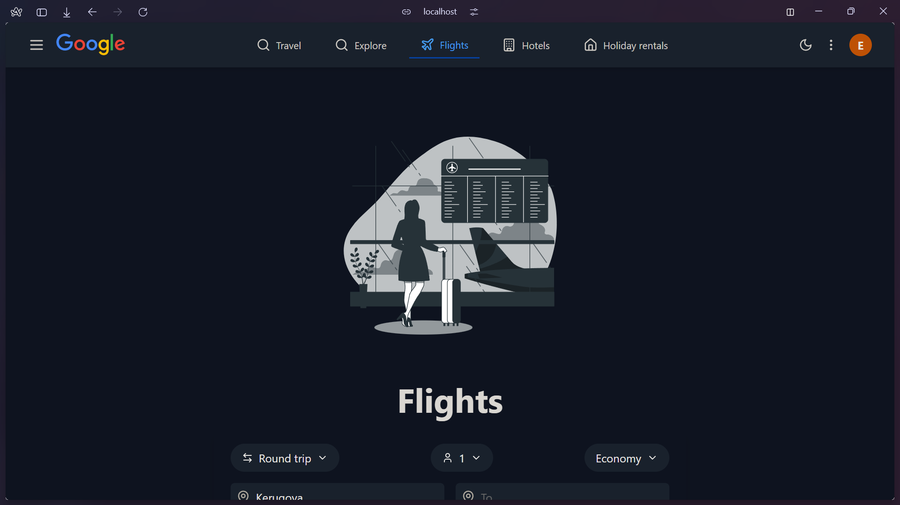
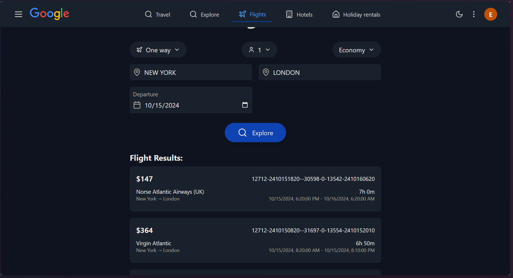

# Google Flights Clone

A responsive travel app interface inspired by Google Travel, built with React, TailwindCSS, and Lucide Icons. The app includes flight search, hotel booking, vacation rentals, and more.

## Features

- Responsive design for mobile and desktop
- Toggleable sidebar navigation
- Flight and hotel search functionality
- Dark mode UI
- Built with modern React components

## Installation

1. Clone the repo:
   ```bash
   git clone https://github.com/ByteSurgeonAmos/flights-alpabet-inc.git
   ```
2. Install dependencies:
   ```bash
   npm install
   ```
3. Start the development server:
   ```bash
   npm start
   ```

## Screenshots

1. **Home Page**  
   

2. **Flight Search**  
   

## Learnings

- Responsive design using media queries and React state management.
- Efficient UI development with TailwindCSS and component-based architecture.
